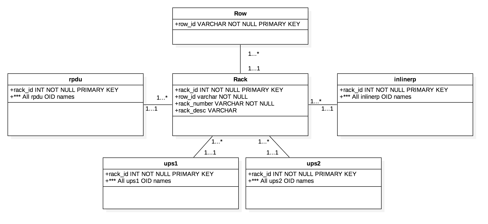

# Data Center Monitor

The Data Center Monitor is currently be used at Florida Atlantic University to monitor the status of the server room in the East Engineering building. This system uses a Python script to run continuously to pull information from each rack in each row within the server, sort the information into a proper format, and store the information into a MySQL Database. Once in the database, the information is displayed through Grafana within the server. The Data Center Monitor system is operating on CentOS 7 on a virtual machine. To ensure the script runs at all time, the Crontab file within the server ensures the python script runs at bootup.


The MySQL Database is designed where there is a table for each given row, which maps to every rack within each row. The next table maps every rack to a specific type or rack, including ads, asdf, and asdf. Although a future implementation may include that a table for each rack, given that the mass amount of data may not be efficient for long term storage. However, this functions will for the current server room storing approximetly 3 months of information.



A single page website utilizing the Bootstrap framework was also made to act as a directory for clicking to a specified graph within Grafana. 


## Software

*Languages Used*
```
Python 3
SQL
HTML
CSS
JavaScript
```

*Applications Used*
```
Grafana
MySQL
StruxureWare DataCenter
ManageEngine MIB Browser
```

*Platforms/Technologies Used*
```
CentOS 7
SNMP
```

## Built With

* [Bootstrap 3] (http://getbootstrap.com/docs/3.3/) - Front-End Framework
* [NetSNMP] (http://www.net-snmp.org) - Simple Network Managemtnt Protocol CLI Application 

## Authors

* **Grant Lanham** - [7grant2](https://github.com/7grant2/)

## License

This project is licensed under the MIT License - see the [LICENSE.md](LICENSE.md) file for details

## Acknowledgments

* Thanks to Moises Levey for guiding me through this project.
* Thanks to Mahesh Neelakanta and FAU Technical Service Group for providing the virtual machine, tools, and support for the use in this project.
